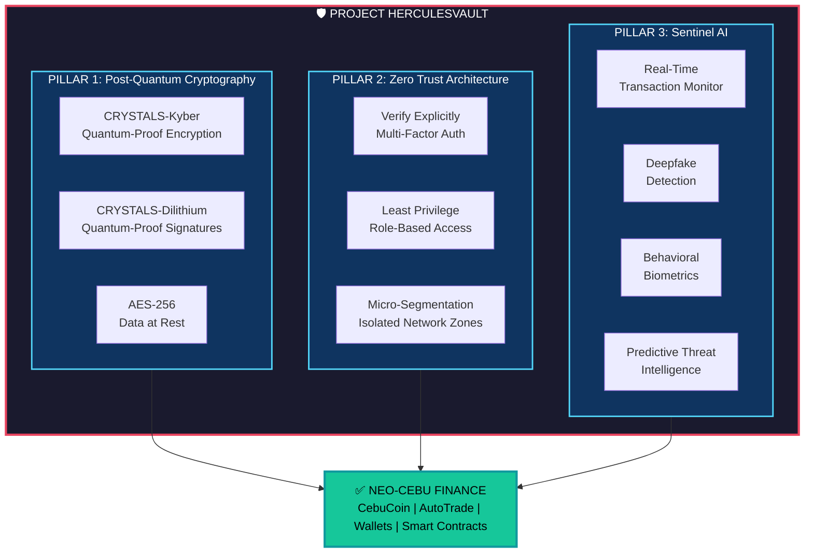
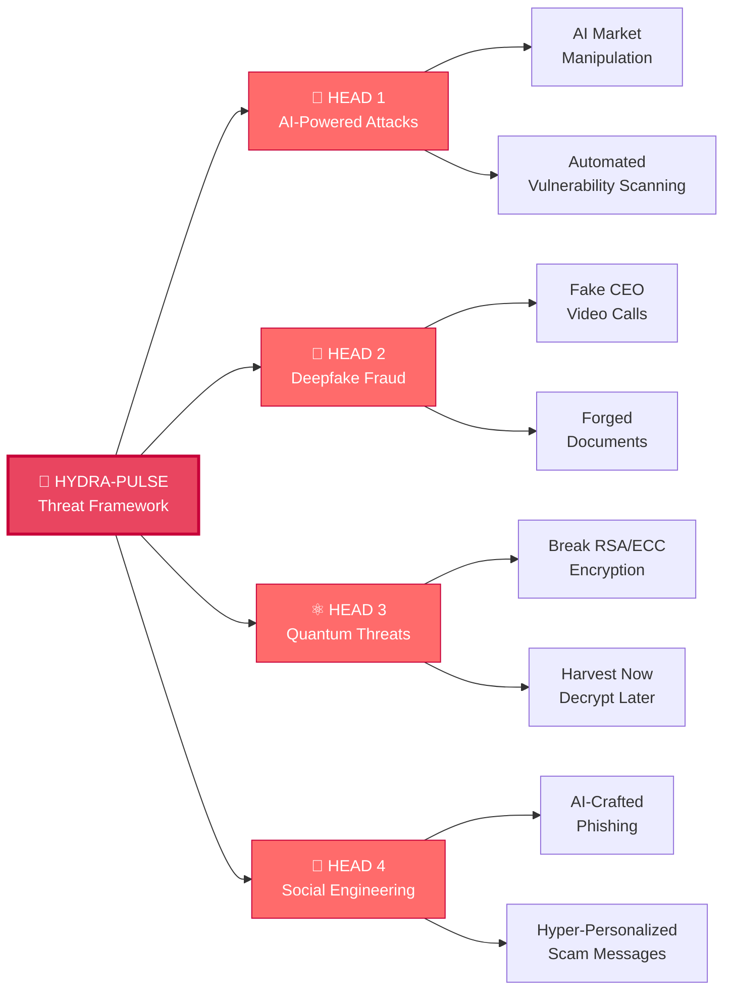
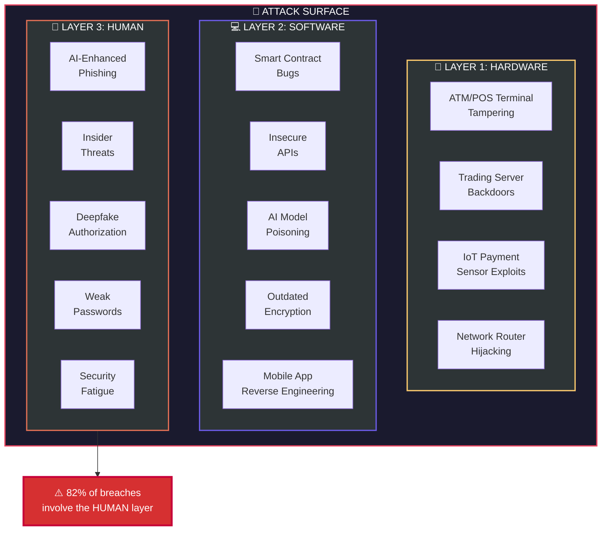
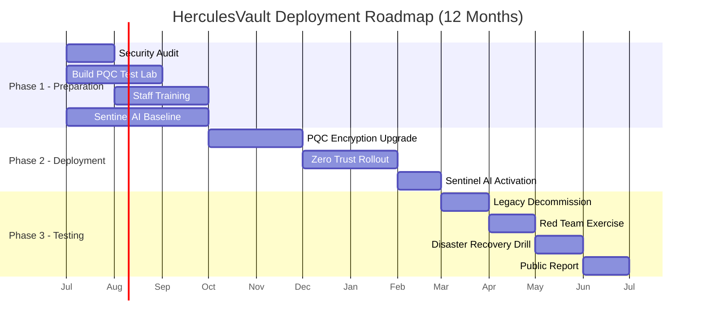
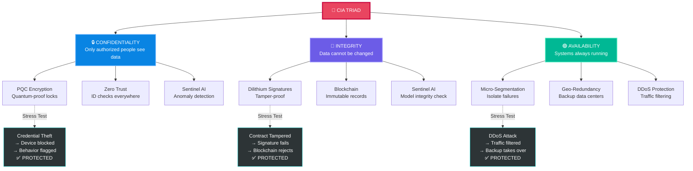
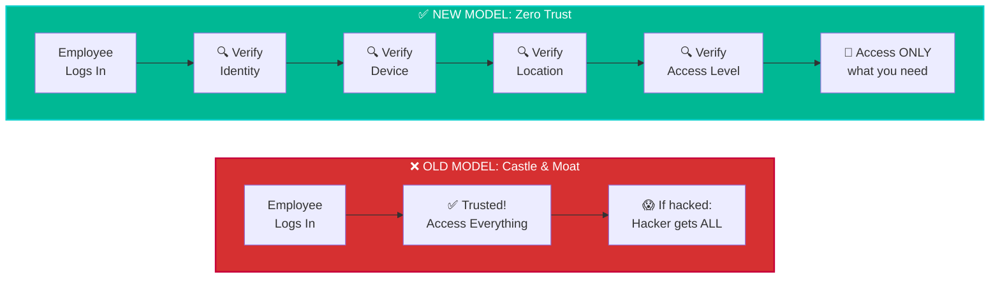
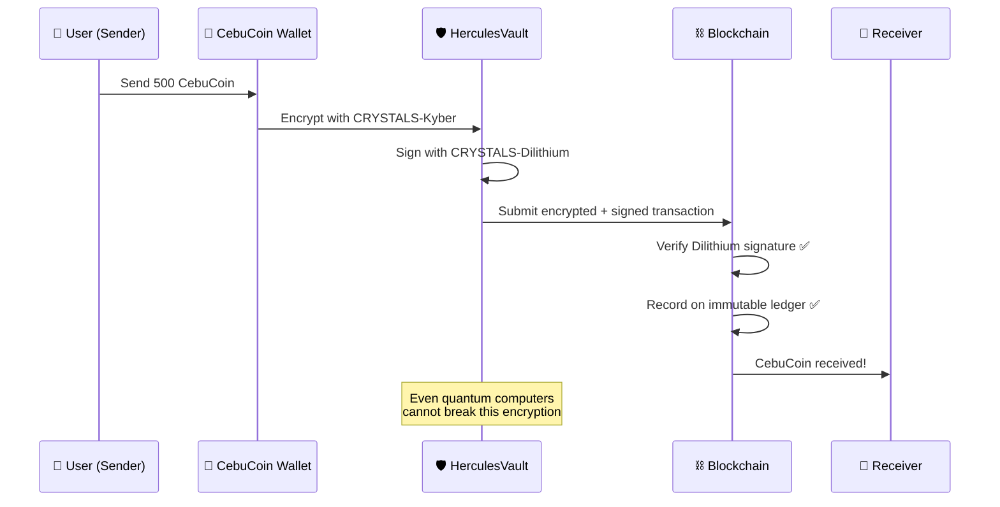

# 📊 VISUAL AIDS — Neo-Cebu 2026: Finance Sector Defense
### Diagrams & Flowcharts for Presentation

> Copy these mermaid diagrams into any mermaid renderer (e.g., [mermaid.live](https://mermaid.live)) to get images for your slides.

---

## 1. 🏗️ HerculesVault Architecture — The 3 Pillars



---

## 2. 🐉 Hydra-Pulse Threat Map



---

## 3. 🎯 Attack Surface Map — 3 Layers



---

## 4. 🚀 12-Month Deployment Timeline



---

## 5. 🔺 CIA Triad — Defense Flowchart



---

## 6. 🔄 Zero Trust vs Old Security Model



---

## 7. 🔐 How PQC Protects CebuCoin Transactions



---

## 📌 HOW TO USE THESE DIAGRAMS

### Option A: Online Renderer (Easiest)
1. Go to **[mermaid.live](https://mermaid.live)**
2. Copy-paste any diagram code above
3. Screenshot or download the result
4. Paste into your PowerPoint/Google Slides

### Option B: VS Code Extension
1. Install the **"Markdown Preview Mermaid Support"** extension
2. Open this file in VS Code
3. Press `Ctrl+Shift+V` to preview
4. Screenshot the diagrams

### Option C: Export as Images
```bash
# Install mermaid CLI
npm install -g @mermaid-js/mermaid-cli

# Convert this file's diagrams to PNG
mmdc -i VISUALS.md -o diagram.png
```

---

## 🎤 WHICH DIAGRAM FOR WHICH PRESENTER

| Presenter | Diagram to Show | When |
|-----------|----------------|------|
| **Mary Grace** | #2 Hydra-Pulse Threat Map | While explaining the 4 threats |
| **Jerimy** | #3 Attack Surface Map (3 Layers) | While mapping vulnerabilities |
| **Ashlee** | #1 HerculesVault Architecture + #6 Zero Trust + #7 PQC Transaction | While explaining the solution |
| **Mike** | #4 Deployment Timeline | While explaining the 12-month plan |
| **Everyone** | #5 CIA Triad Flowchart | During the final Act V |
